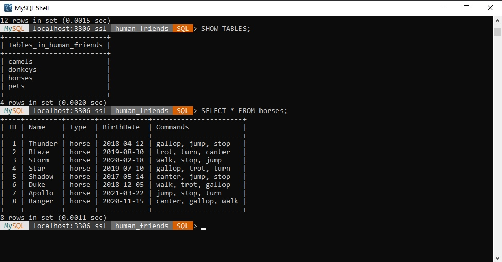
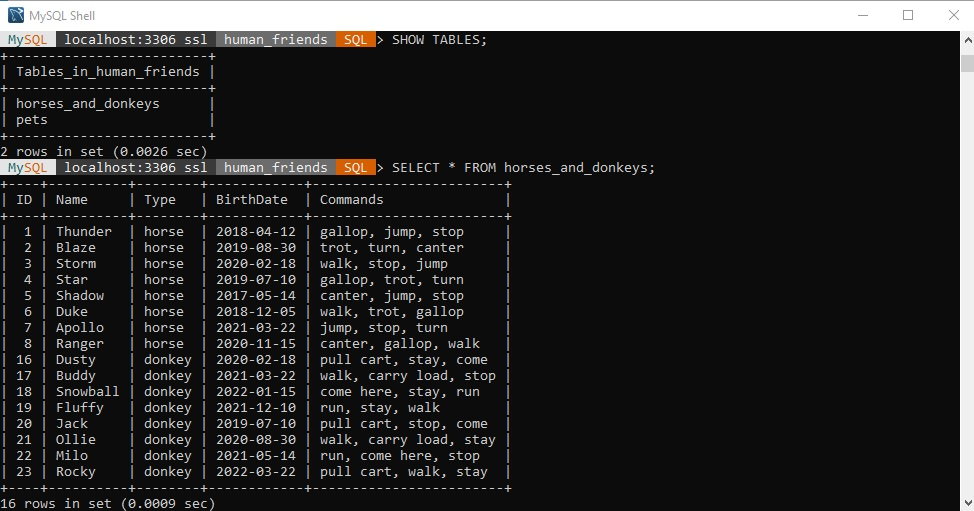
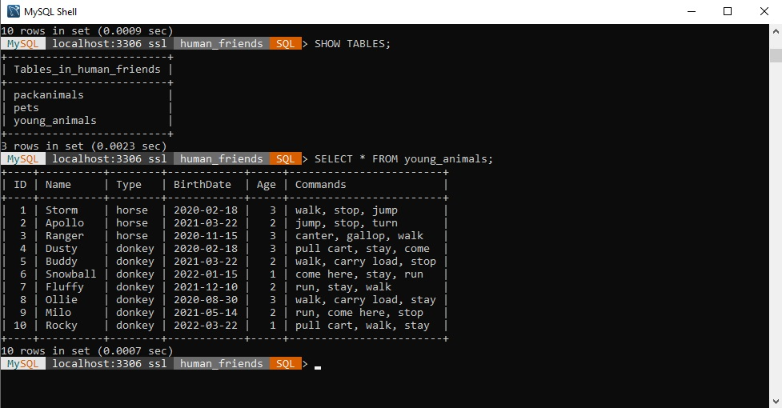
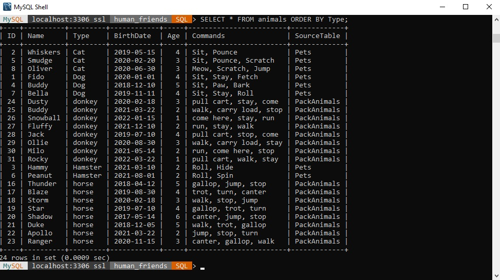

# Итоговая контрольная работа по блоку специализация

## Операционные системы и виртуализация (Linux)

1. **Использование команды cat в Linux**

Используя команду `cat` я создал и заполнил два файла (Pets.txt и PackAnimals.txt), далее объединил их в один новый файл HumanFriends.txt и вывел полученный результат на экран терминала при помощи команды `ls`. 

Вся история команд сохранена в файле [command_history.txt](command_history.txt), который расположен в корне репозитория.


2. **Работа с директориями в Linux**

Далее я создал новую папку в текущей директории и переместил туда файл HumanFriends.txt при помощи команды `mv`.


3. **Работа с MySQL в Linux. “Установить MySQL на вашу вычислительную машину”**

Был скачен с официального сайта и установлен пакет MySQL 
```
wget https://dev.mysql.com/get/mysql-apt-config_0.8.28-1_all.deb
dpkg -i mysql-apt-config_0.8.28-1_all.deb
```

Далее при помощи команды `apt update` был обновлен список команд и установлен пакет из репозитория MySQL *mysql-server*
```
apt install mysql-server
```
В ходе установки возникла ошибка из-за отсутствия свободного места на диске, поэтому пришлось удалить ряд образов Docker'а, что будет отображено в истории команд в файле [command_history.txt](command_history.txt)

В результате удалось установить и запустить сервер MySQL. 


4. **Управление deb-пакетами**

С сайта pkgs.org был скачен и установлен deb-пакет Google Chrome. 


Скачивание пакета с последней стабильной версией было выполнено при помощи команды 
```
wget https://dl.google.com/linux/deb/pool/main/g/google-chrome-stable/google-chrome-stable_133.0.6943.98-1_amd64.deb
```
Далее была выполнена установка пакета при помощи команды
```
dpkg -i google-chrome-stable_133.0.6943.98-1_amd64.deb
```
Установка прошла удачно. При помощи команды `dpkg -l` было проверено наличие программы в системе
```
root@gb-VirtualBox:/home/gb/programmer-block/final-work# dpkg -l | grep google-chrom
ii  google-chrome-stable                       133.0.6943.98-1                              amd64        The web browser from Google
```
Далее пакет был удален при помощи команды `apt remove google-chrome-stable`

5. **История команд в терминале Ubuntu**

Вся история команд по выполнению заданий текущего блока сохранена в файле [command_history.txt](command_history.txt) в корневом каталоге репозитория.

## Объектно-ориентированное программирование

6. **Диаграмма классов**

Была создана [диаграмма классов животных](class_diagram.drawio) на сервисе Draw.io. 
Диаграмма состоит из родительского класса *Животные (Animals)* и двух подклассов *Pets* и *Pack animals*. Оба подкласса наследуют характеристики и методы от родительского класса.


7. **Работа с MySQL**

Была создана БД *Human_Friends* и таблицы с разными категориями животных.
```
CREATE DATABASE Human_Friends;
USE Human_Friends;
CREATE TABLE Pets (
	ID INT AUTO_INCREMENT PRIMARY KEY,
	Name VARCHAR(100) NOT NULL,
	Type VARCHAR(50) NOT NULL,
	BirthDate DATE NOT NULL,
	Commands TEXT
);
CREATE TABLE Horses (
	ID INT AUTO_INCREMENT PRIMARY KEY,
	Name VARCHAR(100) NOT NULL,
	Type VARCHAR(50) NOT NULL,
	BirthDate DATE NOT NULL,
	Commands TEXT
);
CREATE TABLE Camels (
	ID INT AUTO_INCREMENT PRIMARY KEY,
	Name VARCHAR(100) NOT NULL,
	Type VARCHAR(50) NOT NULL,
	BirthDate DATE NOT NULL,
	Commands TEXT
);
CREATE TABLE Donkeys (
	ID INT AUTO_INCREMENT PRIMARY KEY,
	Name VARCHAR(100) NOT NULL,
	Type VARCHAR(50) NOT NULL,
	BirthDate DATE NOT NULL,
	Commands TEXT
);
```
Далее заполняем наши созданные таблицы

```
INSERT INTO Pets (Name, Type, BirthDate, Commands)
VALUES
	('Fido', 'dog', '2020-01-01', 'Sit, Stay, Fetch'),
	('Whiskers', 'cat', '2019-05-15', 'Sit, Pounce'),
	('Hammy', 'hamster', '2021-03-10', 'Roll, Hide'),
	('Buddy', 'dog', '2018-12-10', 'Sit, Paw, Bark'),
	('Smudge', 'cat', '2020-02-20', 'Sit, Pounce, Scratch'),
	('Peanut', 'hamster', '2021-08-01', 'Roll, Spin'),
	('Bella', 'dog', '2019-11-11', 'Sit, Stay, Roll'),
	('Oliver', 'cat', '2020-06-30', 'Meow, Scratch, Jump');

INSERT INTO Horses (Name, Type, BirthDate, Commands)
VALUES 
	('Thunder', 'horse', '2018-04-12', 'gallop, jump, stop'),
	('Blaze', 'horse', '2019-08-30', 'trot, turn, canter'),
	('Storm', 'horse', '2020-02-18', 'walk, stop, jump'),
	('Star', 'horse', '2019-07-10', 'gallop, trot, turn'),
	('Shadow', 'horse', '2017-05-14', 'canter, jump, stop'),
	('Duke', 'horse', '2018-12-05', 'walk, trot, gallop'),
	('Apollo', 'horse', '2021-03-22', 'jump, stop, turn'),
	('Ranger', 'horse', '2020-11-15', 'canter, gallop, walk');
    
INSERT INTO Camels (Name, Type, BirthDate, Commands)
VALUES 
	('Sahara', 'camel', '2017-11-25', 'walk, sit, carry load'),
	('Dune', 'camel', '2016-05-14', 'lie down, stand up, walk'),
	('Sandy', 'camel', '2019-09-20', 'drink, eat, rest'),
	('Humpy', 'camel', '2018-12-05', 'carry load, walk, stop'),
	('Desert', 'camel', '2020-03-15', 'walk, sit, drink'),
	('Oasis', 'camel', '2021-07-10', 'rest, eat, carry load'),
	('Mirage', 'camel', '2019-02-18', 'walk, stop, lie down'),
	('Nomad', 'camel', '2022-01-15', 'carry load, walk, drink');

INSERT INTO Donkeys (Name, Type, BirthDate, Commands)
VALUES 
	('Dusty', 'donkey', '2020-02-18', 'pull cart, stay, come'),
	('Buddy', 'donkey', '2021-03-22', 'walk, carry load, stop'),
	('Snowball', 'donkey', '2022-01-15', 'come here, stay, run'),
	('Fluffy', 'donkey', '2021-12-10', 'run, stay, walk'),
	('Jack', 'donkey', '2019-07-10', 'pull cart, stop, come'),
	('Ollie', 'donkey', '2020-08-30', 'walk, carry load, stay'),
	('Milo', 'donkey', '2021-05-14', 'run, come here, stop'),
	('Rocky', 'donkey', '2022-03-22', 'pull cart, walk, stay');
```
Ниже на скрине приведен пример вывода данных одной из получившихся таблиц (*Лошади*).



Далее удаляем таблицу с верблюдами, а таблицы с лошадьми и ослами объединяем в одну.
```
DROP TABLE Camels;

CREATE TABLE horses_and_donkeys (
	ID INT AUTO_INCREMENT PRIMARY KEY,
    Name VARCHAR(100) NOT NULL,
    Type VARCHAR(50) NOT NULL,
    BirthDate DATE NOT NULL,
    Commands TEXT
	);
INSERT INTO horses_and_donkeys (Name, Type, BirthDate, Commands)
SELECT Name, Type, BirthDate, Commands
FROM Horses;

INSERT INTO horses_and_donkeys (Name, Type, BirthDate, Commands)
SELECT Name, Type, BirthDate, Commands
FROM Donkeys;

DROP TABLE Horses;
DROP TABLE Donkeys;
```
Проверяем промежуточный результат при помощи команд `SHOW TABLES` и `SELECT * FROM horses_and_donkeys`



Далее создадим таблицу для молодых животных от 1 до 3 лет, куда добавим данные из предыдущей таблицы. Возраст животных вычислим при помощи функции `TIMESTAMPDIFF`.
Для того чтобы данные попали под нашу выборку будем рассчитывать возраст животных на момент 01.01.2024 года.

```
CREATE TABLE young_animals (
	ID INT AUTO_INCREMENT PRIMARY KEY,
	Name VARCHAR(100) NOT NULL,
	Type VARCHAR(50) NOT NULL,
	BirthDate DATE NOT NULL,
	Age INT,
	Commands TEXT
	);

INSERT INTO young_animals (Name, Type, BirthDate, Age, Commands)
SELECT 
	Name,
	Type,
	BirthDate,
	TIMESTAMPDIFF(YEAR, BirthDate, '2024-01-01') AS Age,
	Commands
FROM PackAnimals
WHERE TIMESTAMPDIFF(YEAR, BirthDate, '2024-01-01') BETWEEN 1 AND 3;
```
Посмотрим что получилось.



Объединим таблицы *Pets* и *PackAnimals* в одну таблицу с сохранением привязки с исходным таблицам.
Для этого добавим дополнительный столбец, указывающий на исходную таблицу. 
Так же в новую таблицу добавим графу с возрастом животных.
```
CREATE TABLE Animals (
	ID INT AUTO_INCREMENT PRIMARY KEY,
	Name VARCHAR(100) NOT NULL,
	Type VARCHAR(50) NOT NULL,
	BirthDate DATE NOT NULL,
	Age INT,
	Commands TEXT,
	SourceTable VARCHAR(50) 
);

INSERT INTO Animals (Name, Type, BirthDate, Age, Commands, SourceTable)
SELECT
	Name,
	Type,
	BirthDate,
	TIMESTAMPDIFF(YEAR, BirthDate, '2024-01-01') AS Age,
	Commands,
	'Pets' AS SourceTable
FROM Pets;

INSERT INTO Animals (Name, Type, BirthDate, Age, Commands, SourceTable)
SELECT
	Name,
	Type,
	BirthDate,
	TIMESTAMPDIFF(YEAR, BirthDate, '2024-01-01') AS Age,
	Commands,
	'PackAnimals' AS SourceTable
FROM PackAnimals;
```
В конце выведем результат на экран, отсортировав животных по их категориям с помощью команды `ORDER BY Type`



Весь скрипт с выполнением заданий расположен в корне репозитория под названием [human_friends.sql](human_friends.sql).

8. **ООП и Java**

Структура проекта выстроена по шаблону **Model-View-Presenter (MVP)** с использованием паттерна **Factory**.
Посчитал паттерн Factory наиболее удачным для данного проекта, потому что он дает ряд преимуществ в использовании, таких как:

    1. Гибкость: Легко добавлять новые типы животных, не изменяя существующий код.
    2. Инкапсуляция: Логика создания объектов животных скрыта в фабрике.
    3. Масштабируемость: Можно создавать разные фабрики для разных типов животных (например, для вьючных и домашних).

Сам проект разбит на несколько пакетов:
- **model** - отвечает за данные и бизнес-логику (в нашем случае это иерархия классов);
- **factory** - реализует логику создания новых экземпляров классов;
- **registry** - описывает создание реестра домашних животных;
- **view** - отвечает за отображение данных и взаимодействие с пользователем (в нашем случае через консоль);
- **presenter** - выступает посредником между Model и View, обрабатывает логику взаимодействия.

Пакет **model** включает в себя иерархию классов, которая была изображена на диаграмме в пункте 6 данной работы.
Иерархия состоит из абстрактного родительского класса **Pet** и его дочерних классов **Cat**, **Dog** и **Hamster**. 

9. **Программа-реестр домашних животных**


10. **Счетчик животных**