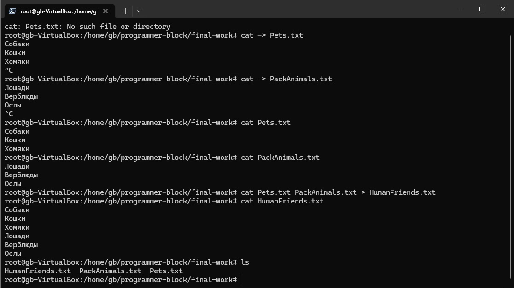
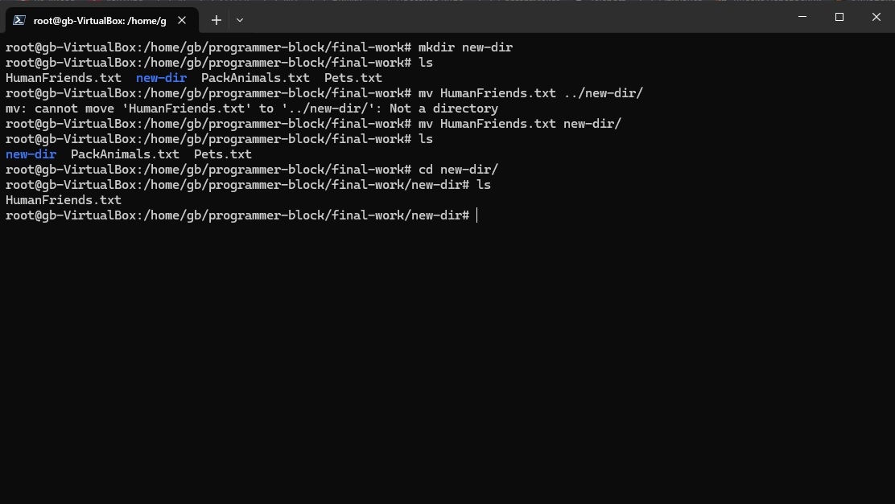
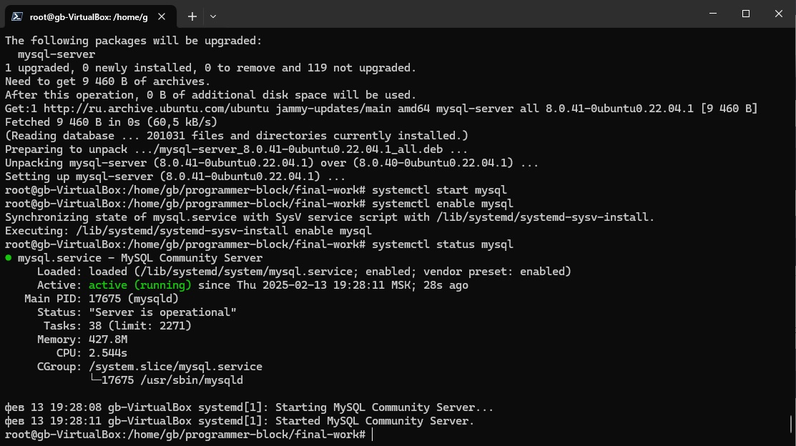
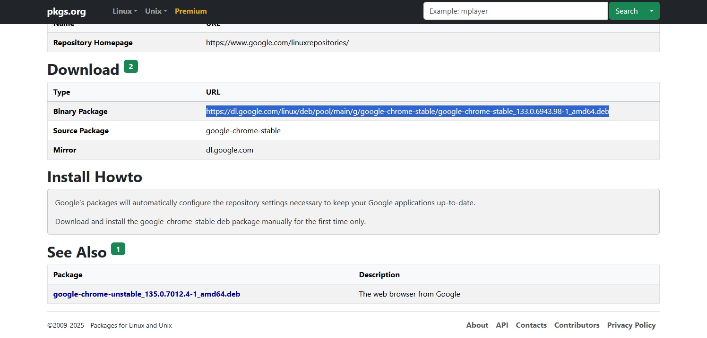
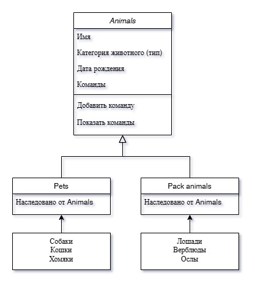

# Итоговая контрольная работа по блоку специализация

## Операционные системы и виртуализация (Linux)

1. **Использование команды cat в Linux**

Используя команду `cat` я создал и заполнил два файла (Pets.txt и PackAnimals.txt), далее объединил их в один новый файл HumanFriends.txt и вывел полученный результат на экран терминала при помощи команды `ls`. 

Вся история команд сохранена в файле [command_history.txt](command_history.txt), который расположен в корне репозитория.



2. **Работа с директориями в Linux**

Далее я создал новую папку в текущей директории и переместил туда файл HumanFriends.txt при помощи команды `mv`.



3. **Работа с MySQL в Linux. “Установить MySQL на вашу вычислительную машину”**

Был скачен с официального сайта и установлен пакет MySQL 
```
wget https://dev.mysql.com/get/mysql-apt-config_0.8.28-1_all.deb
dpkg -i mysql-apt-config_0.8.28-1_all.deb
```

Далее при помощи команды `apt update` был обновлен список команд и установлен пакет из репозитория MySQL *mysql-server*
```
apt install mysql-server
```
В ходе установки возникла ошибка из-за отсутствия свободного места на диске, поэтому пришлось удалить ряд образов Docker'а, что будет отображено в истории команд в файле [command_history.txt](command_history.txt)

В результате удалось установить и запустить сервер MySQL. 



4. **Управление deb-пакетами**

С сайта pkgs.org был скачен и установлен deb-пакет Google Chrome. 



Скачивание пакета с последней стабильной версией было выполнено при помощи команды 
```
wget https://dl.google.com/linux/deb/pool/main/g/google-chrome-stable/google-chrome-stable_133.0.6943.98-1_amd64.deb
```
Далее была выполнена установка пакета при помощи команды
```
dpkg -i google-chrome-stable_133.0.6943.98-1_amd64.deb
```
Установка прошла удачно. При помощи команды `dpkg -l` было проверено наличие программы в системе
```
root@gb-VirtualBox:/home/gb/programmer-block/final-work# dpkg -l | grep google-chrom
ii  google-chrome-stable                       133.0.6943.98-1                              amd64        The web browser from Google
```
Далее пакет был удален при помощи команды `apt remove google-chrome-stable`

5. **История команд в терминале Ubuntu**

Вся история команд по выполнению заданий текущего блока сохранена в файле [command_history.txt](command_history.txt) в корневом каталоге репозитория.

## Объектно-ориентированное программирование

6. **Диаграмма классов**

Была создана [диаграмма классов животных](class_diagram.drawio) на сервисе Draw.io. 
Диаграмма состоит из родительского класса *Животные (Animals)* и двух подклассов *Pets* и *Pack animals*. Оба подкласса наследуют характеристики и методы от родительского класса.



7. **Работа с MySQL**

Была создана БД *Human_Friends* и таблицы с разными категориями животных.
```
CREATE DATABASE Human_Friends;
USE Human_Friends;
CREATE TABLE Pets (
	ID INT AUTO_INCREMENT PRIMARY KEY,
	Name VARCHAR(100) NOT NULL,
	Type VARCHAR(50) NOT NULL,
	BirthDate DATE NOT NULL,
	Commands TEXT
);
CREATE TABLE Horses (
	ID INT AUTO_INCREMENT PRIMARY KEY,
	Name VARCHAR(100) NOT NULL,
	Type VARCHAR(50) NOT NULL,
	BirthDate DATE NOT NULL,
	Commands TEXT
);
CREATE TABLE Camels (
	ID INT AUTO_INCREMENT PRIMARY KEY,
	Name VARCHAR(100) NOT NULL,
	Type VARCHAR(50) NOT NULL,
	BirthDate DATE NOT NULL,
	Commands TEXT
);
CREATE TABLE Donkeys (
	ID INT AUTO_INCREMENT PRIMARY KEY,
	Name VARCHAR(100) NOT NULL,
	Type VARCHAR(50) NOT NULL,
	BirthDate DATE NOT NULL,
	Commands TEXT
);
```

8. **ООП и Java**


9. **Программа-реестр домашних животных**


10. **Счетчик животных**